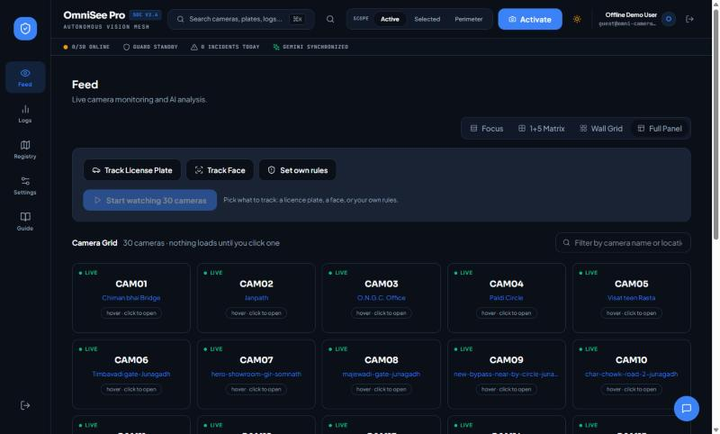
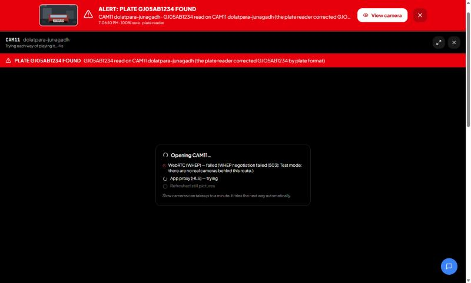

# Feed > Full Panel: every camera, and tracking across all of them

A fourth view next to Focus, 1+5 Matrix and Wall Grid. Every camera is a tile; **nothing loads until you click one**. Above the tiles are three ways
to watch **all** cameras at once, in the background, whether or not you have one open:

| Option | You give | What watches | Cost |
|---|---|---|---|
| **Track License Plate** | a plate (spaces and capitals do not matter) | the ANPR plate reader, on every camera. Gemini reads plates only if the plate reader is not set up or fails, and says so ("unverified read") | none for the plate reader |
| **Track Face** | a photo of the person | Gemini compares each camera with the photo | one Gemini call per camera per cycle |
| **Set own rules** | a few words, the same kind of text as a camera's *Suspicious Rules* (you can load a camera's own) | Gemini applies the rules to every camera | one Gemini call per camera per cycle |

When the plate, the face or a rule is found, a **red alert** appears over whichever tab is open (with the frame as evidence and a short alarm), and the camera it was found
on **opens full screen**. The alerts stay listed under the status line, each with an Open button, and the tile of that camera turns red.



## Opening a camera

Clicking a tile (or an alert) opens the camera full screen and **tries each way of playing it, one after the other**, until one shows a picture. The list shows how far it got:

1. the media server (HLS), if there is one;
2. WebRTC (WHEP) straight from the grid. For a tile this is opt-in per URL; here it is simply one of the ways to try;
3. the app's own HLS proxy (needs the grid login);
4. a still picture refreshed every 4 seconds (needs the grid login). It shows something whenever the camera answers at all.

If a picture stops for 20 seconds it starts the list again. Esc or the X closes it. Slow cameras can take up to a minute; each step has its own timeout (45, 25, 60, 30 s).



## How tracking works

One job at a time (`server/tracking.ts`, routes in `server/trackingRoutes.ts`), running on the server, so it does not depend on the browser tab:

- **Every 10 seconds per camera** (`TRACK_INTERVAL_S`, not below 5), counted from when that camera's last check started. The 30 cameras are spread across the interval, and at most 4 checks run at
  once (`TRACK_CONCURRENCY`). A camera that cannot be captured backs off (up to 60 s) so one dead camera does not take the budget. The status line shows the **measured** cycle, which is longer than 10 s when the grid or the model is slow.
- **A scene that did not change** since the last check is not sent to the model again, but every camera is still analysed at least once a minute (`TRACK_GATE_MAX_SKIP_S`; `ANALYSIS_GATE=off` turns the gate off).
- **A plate** matches when the read equals the typed one. A read that differs only by characters OCR confuses (0/O, 1/I, 8/B, 5/S, 2/Z, 6/G, U/V, at most two) is reported as a *possible* match. A plate that differs by one
  ordinary character is a different car and is not reported. The ANPR service also corrects look-alikes by Indian plate format, and the alert says when it did.
- **A face or rule** needs Gemini to be at least 70% sure (`TRACK_MIN_CONFIDENCE`). The face prompt asks for a visible face and at least two distinctive features, and says a silhouette or a distant figure is not a match.
- **One alert per camera per 30 seconds** (`TRACK_ALERT_COOLDOWN_S`). A parked car does not raise a new alarm every ten seconds; the hits are still counted.
- The camera login comes from the request (Settings > stream access) or `STREAM_EMAIL` / `STREAM_PASSWORD`, is kept only in memory while the job runs, and is never returned.

Any signed-in user can start it (a guest in the local demo, with `MEDIA_ALLOW_GUESTS=true`). Starting a new job replaces the running one.

## What to expect on real cameras (read this)

- **Gemini cost.** At 10 s over 30 cameras, face and rule tracking can make up to **180 Gemini calls a minute**: roughly 260,000 a day if every scene keeps changing. At about $0.002 a call (an estimate for roughly 1,500 tokens in and 350 out; check Google's current price) that is hundreds of dollars a day, and Gemini's own rate limits may come first. The frame gate removes unchanged scenes, which on a quiet street is most of them, but not on busy ones. Plate tracking uses no Gemini. The panel shows
  the call count while it runs. For long runs, raise `TRACK_INTERVAL_S` or watch fewer cameras.
- **ANPR speed.** On the demo PC's CPU the plate reader takes 0.5 to 1.2 s a frame, so 30 cameras every 10 s is more than it can do (the first pass over 30 cameras took about 55 s). The panel says "N cameras are behind
  schedule". A GPU (`ANPR_DEVICE=cuda`) or fewer cameras fixes it. When the plate reader times out under load the plate is read by Gemini instead, marked unverified, which costs a Gemini call.
- **The grid limits one account.** Capturing 30 cameras every 10 s means many short RTSP sessions on one login, which is the pattern that made the grid answer 401 earlier. This has **not been tried against the real grid**.
  The tracker backs off a camera that fails but does not yet pause everything when the grid blocks the account.
- **Faces are the weakest option.** A model comparing a photo with CCTV frames makes mistakes both ways; treat an alert as "a person should look", not as an identification.

## Testing it without the real cameras

`scripts/fake-grid.mjs` draws 30 pretend camera pictures (a car with a plate, three pretend people, a figure climbing a fence, an unattended bag, ordinary streets). Everything is drawn, so nobody real is pictured; it tests the pipeline, not recognition accuracy on real footage.

```bash
node scripts/fake-grid.mjs                         # 30 pictures + 3 face photos in .demo-logs/fake-grid
TRACKING_FAKE_FRAMES_DIR=.demo-logs/fake-grid      # set this on the app server: the tracker reads these pictures instead of the cameras
node scripts/fake-grid.mjs put cam21 plate GJ05AB1234   # change ONE camera while tracking runs (plate TEXT | face a|b|c | climb | bag | calm)
```

With `TRACKING_FAKE_FRAMES_DIR` set, the WebRTC and HLS routes answer 503 at once and the snapshot route serves the pictures, so the open-a-camera steps run without anything leaving the PC. **Never set it in production.**
The photo to upload for "Track Face" is `.demo-logs/fake-grid/face-a.jpg`.

### What was run (2026-10-09, in a real browser, the real ANPR service and the real Gemini API)

| Test | Result |
|---|---|
| **Plate** `gj 05 ab 1234` over 30 cameras | Found on cam07 (plate reader, 99.8%) and cam11 (the drawn plate `GJO5AB1234` with a letter O, corrected by the plate reader to `GJ05AB1234`; the alert says so). `MH12DE1433` on cam03 was read and ignored; `GJ05AB1235` on cam15 (one digit off) was not reported. |
| **Face**, a pretend person A | Found on cam19 (100%). Pretend persons B and C (cam23, cam09) were not matched. With the first version of the prompt Gemini also matched four faceless walking silhouettes at 80 to 90%; the stricter prompt cut that to **one** false alert (cam26, whose climbing figure happens to have a curly beard). |
| **Rules** "a person climbing over a fence or wall" | Only cam26 of the 30. "An unattended bag" flagged only cam13. |
| **Live change**: cam21 changed to a bag while the rule ran and cam13 was on screen | Detected about 10 s later, and the screen moved to cam21 by itself. |
| Opening a camera | WebRTC failed, the proxy failed, "Refreshed still pictures" showed the picture, with the list showing each step. |

Screenshots: [panel](full-panel/01-full-panel.jpg), [plate tracking running](full-panel/02-plate-tracking-running.jpg), [the plate alert with the camera focused](full-panel/04-plate-alert-camera-focused.jpg),
[face alert](full-panel/05-face-alert.jpg), [rule alert after a live change](full-panel/06-rules-alert-live-change.jpg), [status and alert list](full-panel/07-status-and-alert-list.jpg), [red tiles](full-panel/08-red-tiles.jpg).

For this test the ANPR service ran with `ANPR_DETECTOR_CONF=0.05` (its default is 0.4): a drawn plate is not photo-real, so the plate detector was not confident enough at 0.4 to find it, although the OCR then read it correctly. Real plates in real footage
need the default. Not covered: real cameras, a real face, the grid's account limits, a signed-in Firebase user (the guest switch was used), and more than one browser watching at once.

## Settings

| Variable | Default | Meaning |
|---|---|---|
| `TRACK_INTERVAL_S` | 10 | Seconds between two checks of the same camera (not below 5) |
| `TRACK_CONCURRENCY` | 4 | Checks in flight at once |
| `TRACK_MIN_CONFIDENCE` | 0.7 | How sure Gemini must be of a face or rule hit (0 to 1) |
| `TRACK_ALERT_COOLDOWN_S` | 30 | No second alert for the same camera inside this time |
| `TRACK_GATE_MAX_SKIP_S` | 60 | Longest a camera goes without being analysed when its scene does not change |
| `TRACKING_FAKE_FRAMES_DIR` | unset | Test mode, see above |
| `ANPR_SERVICE_URL`, `ANPR_API_KEY`, `ANPR_TIMEOUT_MS` | unset, unset, 8000 | The plate reader (`node scripts/demo.mjs up --anpr` starts it) |
